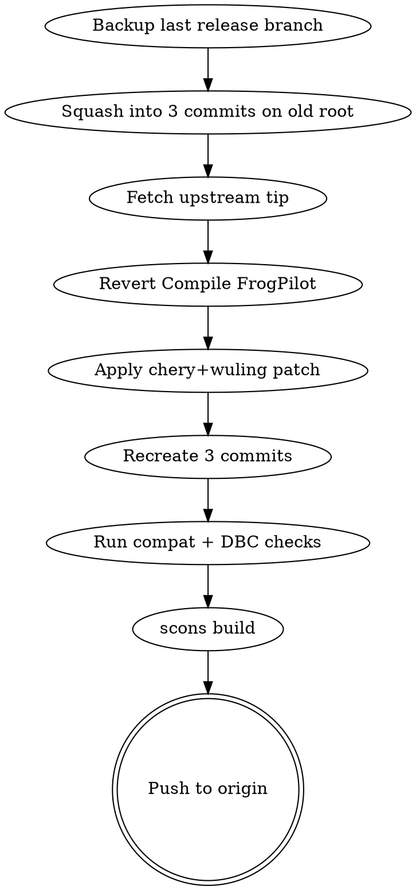

# Forward-porting FrogPilot

Workflow for syncing garudapilot with new `frogpilot/FrogPilot-Staging` upstream while preserving the **chery + wuling** car-port layers.

## When to use

- New commits on `frogpilot/FrogPilot-Staging` since last sync
- User reports chery/wuling broken after an attempted merge
- Starting fresh on a new machine with this fork

## Core principle

**Backup before squash. Squash before forward-port. Forward-port = apply diff between backup and pre-squash boundary, not full history.**

The chery+wuling code lives in `selfdrive/car/chery/`, `selfdrive/car/wuling/`, `panda/board/safety/safety_{chery,wuling}.h`, and ~30 infra files. Upstream FrogPilot and chery+wuling have **no shared ancestor** — direct `git merge` impossible. The 60+ iterative chery+wuling commits collapse into 3 logical ones, replayed onto the new tip.

## Quick workflow



## Steps

```bash
cd garudapilot
git fetch frogpilot FrogPilot-Staging
LAST=FP-Staging-$(cat docs/UPDATE_FROM_FROGPILOT.md | grep -oP 'FP-Staging-\d{6}' | head -1 | sed 's/FP-Staging-//')
NEW=FP-Staging-$(date +%m%Y)

# 1. Backup
git branch backup/$LAST $LAST

# 2. Squash $LAST into 3 commits
git reset --hard backup/$LAST
git reset --soft $(git rev-list --max-parents=0 backup/$LAST)
git reset HEAD
# → see references/file-groups.md for the 3 file lists
# commit 1: feat → commit 2: infra → commit 3: docs
git checkout -- .        # discard periodic FrogPilot patch noise

# 3. New branch + revert Compile FrogPilot
git checkout -b $NEW frogpilot/FrogPilot-Staging
git revert --no-edit HEAD

# 4. Generate + apply patch from pre-squash boundary
git diff ffdcf77f..backup/$LAST > /tmp/chery-wuling.patch
git apply --3way /tmp/chery-wuling.patch
# resolve remaining conflicts manually if any

# 5. Recreate 3 commits on $NEW (same file groups)
git reset HEAD

# 6. Compat checks
python3 scripts/compat_check.py
python3 scripts/dbc_check.py

# 7. scons build (requires openpilot Docker)
scons -j$(nproc)

# 8. Push
git push -u origin $NEW
```

## Risk hotspots

| Area | Risk | Symptom if broken |
|---|---|---|
| `panda/board/safety.h` | `safety_hooks` struct changes | C compile error in safety_chery.h |
| `cereal/car.capnp` | Schema field index shifts | `AttributeError` in carstate.py at runtime |
| `selfdrive/car/interfaces.py` | Base signature drift | TypeError on apply() call |
| `frogpilot/common/frogpilot_variables.py` | New toggle names, removed ones | `frogpilot_toggles.x` AttributeError |
| `common/op_params.py` | upstream replaces it | `ImportError: opParams` |
| `safety_chery.h` ↔ `chery_canfd.dbc` | ID mismatch | panda TX/RX fails silently |

## Files

- `scripts/compat_check.py` — import + abstract-method + safety-wiring audit
- `scripts/dbc_check.py` — every `cp.vl["MSG"]["SIG"]` exists in DBC
- `references/file-groups.md` — exact file lists for the 3 squash commits

## Common mistakes

- **Cherry-picking all 60 wuling commits** — doesn't work, no shared ancestor. Always squash first.
- **Skipping the `Compile FrogPilot` revert** — patch applies to wrong baseline, conflicts cascade
- **Staging periodic FrogPilot patches** — they're obsolete (upstream already has them). Use `git checkout -- .` after squash to discard.
- **Using `git diff` between backup and HEAD instead of `ffdcf77f..backup`** — drags in periodic FrogPilot noise that conflicts with new tip
- **Pushing without `scons`** — runtime crashes only on device. Hard to debug remotely.

## Rollback

```bash
git branch -f $LAST backup/$LAST     # restore last release
git branch -D $NEW                    # drop failed port
git branch -D backup/$LAST           # only if confident
```

## Reference

Full step-by-step with copy-paste commands: `docs/UPDATE_FROM_FROGPILOT.md` (committed in repo).